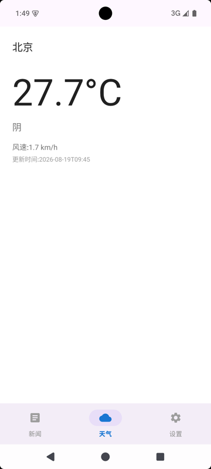
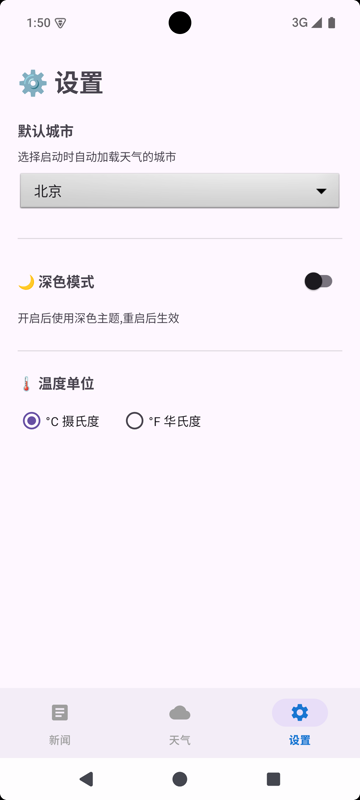

# WeatherNewsApp 项目总结 — 20 天从零到完整 MVVM App

> 作者：袁明
> 日期：2026-08-19
> 项目地址：https://github.com/yourname/WeatherNews
> 配套笔记：本目录下 `day01.md` ~ `day20.md` 共 20 篇

---

## 0. 整体架构

```
┌──────────────────────────────────────────────────────┐
│                                                      │
│     ┌────────────┐ ┌────────────┐ ┌────────────┐     │
│     │    News    │ │  Weather   │ │  Settings  │     │
│     │  Fragment  │ │  Fragment  │ │  Fragment  │     │
│     └─────┬──────┘ └─────┬──────┘ └─────┬──────┘     │
│           └──────────────┴──────────────┘            │
│                         │ ▲  StateFlow               │
│                         ▼ │  (UiState)               │
│               ┌─────────────────────┐                │
│               │       ViewModel     │                │
│               └───────────┬─────────┘                │
│                           │ ▲                        │
│                           ▼ │                        │
│               ┌─────────────────────┐                │
│               │      Repository     │                │
│               └───┬───────────────┬─┘                │
│                   │               │                  │
│          ┌────────▼─────┐  ┌──────▼───────┐          │
│          │   Retrofit   │  │  Room +      │          │
│          │ News/Weather │  │  DataStore   │          │
│          │     API      │  │  (Settings)  │          │
│          └──────────────┘  └──────────────┘          │
│                                                      │
└──────────────────────────────────────────────────────┘
```

---

## 一、技术栈

| 维度     | 选型                                                          | 说明                            |
| -------- | ------------------------------------------------------------- | ------------------------------- |
| 语言     | Kotlin 2.0.21                                                 | 官方推荐，Java 兼容             |
| 构建     | Gradle 8.10 + AGP 8.7.2 + JDK 17                              | Android Studio 官方推荐组合     |
| 最低 SDK | 28 (Android 9.0)                                              | 覆盖 95%+ 在用设备              |
| UI       | XML + ConstraintLayout + RecyclerView                         | 入门友好，调试直观              |
| 架构     | MVVM + Repository + Hilt                                      | 与 Google 推荐架构对齐          |
| 异步     | Kotlin Coroutines 1.9.0 + StateFlow                           | 替代 RxJava，学习曲线低         |
| 网络     | Retrofit 2.11 + OkHttp 4.12 + Gson                            | 业界标准组合                    |
| 本地缓存 | Room 2.6.1 + DataStore Preferences 1.1.1                      | 替代 SharedPreferences / SQLite |
| 导航     | Jetpack Navigation 2.8.5                                      | 单 Activity 多 Fragment         |
| DI       | Hilt 2.52                                                     | 与 Jetpack 深度集成             |
| 图片加载 | Coil 2.7.0                                                    | Day 13 挑战                     |
| 下拉刷新 | SwipeRefreshLayout 1.1.0                                      | Day 15 挑战                     |
| 测试     | JUnit 4.13.2 + MockK 1.13.13 + Espresso 3.6.1 + JaCoCo 0.8.12 | 三层测试金字塔                  |
| 静态检查 | ktlint 12.1.0                                                 | 轻量级格式化检查器              |

---

## 二、架构演进（4 周变化）

### Week 1：裸写

- 一个 MainActivity 写所有 UI；新闻数据 `listOf(...)` 写死；详情用 Intent 序列化
- 入门 Activity、Fragment、RecyclerView、ConstraintLayout

### Week 2：网络 + 缓存

- 接入 Retrofit 调天行数据（新闻）+ Open-Meteo（天气）API
- Room 缓存天气断网可看
- DataStore 保存默认城市（温度单位/主题）
- Activity 装不下，拆 Fragment + BottomNavigationView

### Week 3：MVVM + Jetpack 重构

- 引入 ViewModel + StateFlow
- Repository 模式 + Hilt 依赖注入
- Navigation 替换手动 Fragment 切换
- 新闻接真实中文数据

### Week 4：测试 + 收尾

- ViewModel / Repository 单测（JUnit 4 + MockK）
- Espresso UI 测试 + Hilt 测试替换（HiltTestRunner）
- JaCoCo 覆盖率（合并单测+UI 后 52% / 25%）
- ktlint 静态检查 0 violations
- README + KDoc 覆盖核心类
- Git 三层分支（main / develop / feature/*）

---

## 三、测试心得

1. **MockK 的 `coEvery` 是协程测试入口**：ViewModel 用 `suspend fun` 调 Repository，单测必须 `coEvery { repo.fetch() } returns ...`，否则 MockK 不处理挂起。
2. **StateFlow 测试用 `flow.first()` 比持续 collect 简单**：单测只需断言第一次发射值。
3. **Espresso 注入假数据用 HiltTestRunner**：不要用全局 `setSingletonInstance` hack；用 `@HiltAndroidTest` + `replace` module 注入假 Repository。
4. **覆盖率看"覆盖了哪些分支"而非绝对数字**：Repository 覆盖 3 条路径（成功/异常/缓存）价值高于 ViewModel 只测成功路径。
5. **合并单测+UI 覆盖率要写自定义 JacocoReport**（Day 20 实战）：AGP 的 `createDebugCoverageReport` 只是分别生成两份并不合并，要真合并得自定义任务把 `.exec` 和 `.ec` 一起喂给 `executionData`。注意 unit 原始字节码 vs 设备端 Asm 插桩字节码 classId 不一致的坑。

---

## 四、数据（截至 Day 20）

- 20 个 feature 分支（`feature/day01-bootstrap` ~ `feature/day19-readme-lint`）
- 5 个单测类（ExampleUnitTest + 2×ViewModel + 2×Repository） + 3 个 UI 测试类
- JaCoCo 整体行覆盖率：**单测 23%，合并单测+UI 后 52%**（分支 25%）
- ktlint 0 violations
- README 1 篇，KDoc 覆盖 6 个核心类
- v1.0-stage1 tag 已重打到最新 main HEAD

## 五、运行截图（Day 20 收尾日 6 张作品集）

### 启动页（底部导航 + 新闻 Tab）


### 新闻列表


### 新闻详情


### 天气详情



### 设置页



### 网络异常错误态


